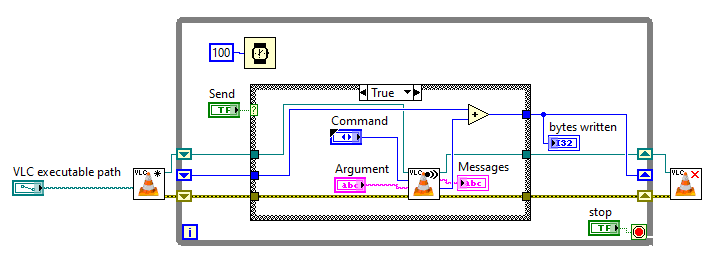

# VLCLabVIEWInterface
A simple interface for controlling VLC player from LabVIEW via the RC interface using a TCP socket.

Written in LabVIEW 2015. Likely compatible with a wide variety of versions.

A demo VI is included to illustrate basic usage:

